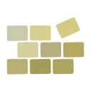

  

 

 
  <a href="https://marketplace.visualstudio.com/items?itemName=Ar-mane.component-maker">
  
  
  

 
 

# Component Maker ⚡

Explore our documentation for more information on how to use Component Maker to speed up your development workflow. Detailed guides and API references are available to help you get started:

  

 

## Support the Project

If you find Component Maker useful, consider supporting the project by buying the dev a coffee. Your support is greatly appreciated and helps keep the project going!

  

